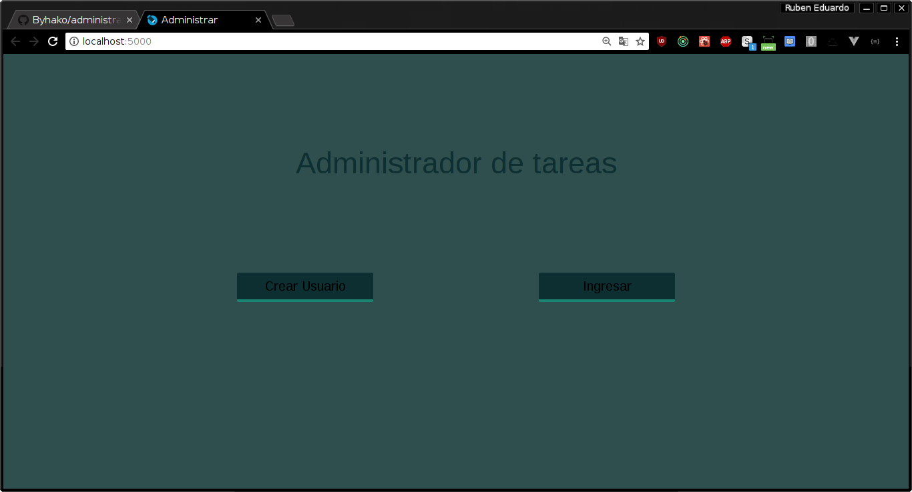

# Aplicación de administración de tareas.

Aplicación desarrollada en React, con stylus como preprocesador de css.
El servidor esta hecho en express y la base de datos con MongoDb version v4.0.5.

### use:

+ **Iniciamos mongoDb**

Nos ubicamos en la carpeta /server/services y corremos:

```
$ mongod --dbpath /home/ruben/Escritorio/administracion-tareas/server/services
```

+ **Iniciamos el servidor**
Dentro de la carpeta server corremos:
```
$ npm install
$ npm run dev
```

+ **Iniciamos UI**
Dentro de la carpeta client corremos:
```
$ npm install
$ npm start
```

---------------------------------
Al iniciar la aplicación tenemos la pantalla de bienvenida.

<p align="center">
  
</p>