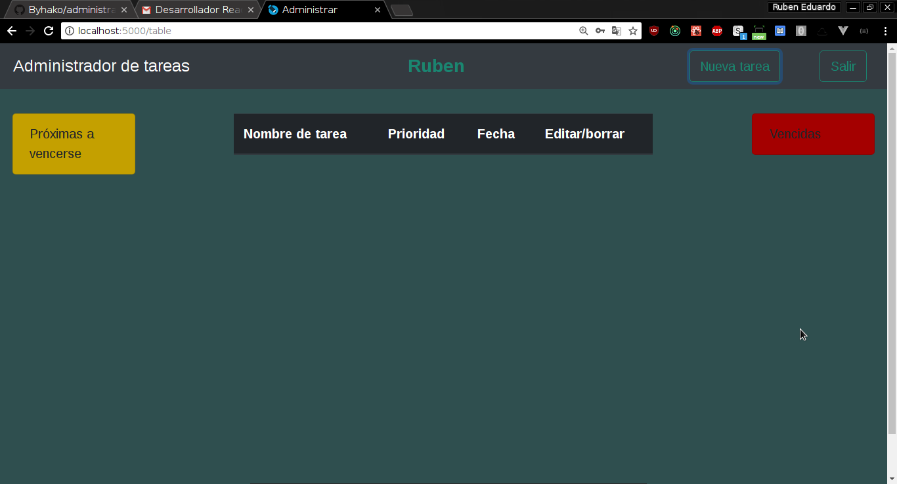
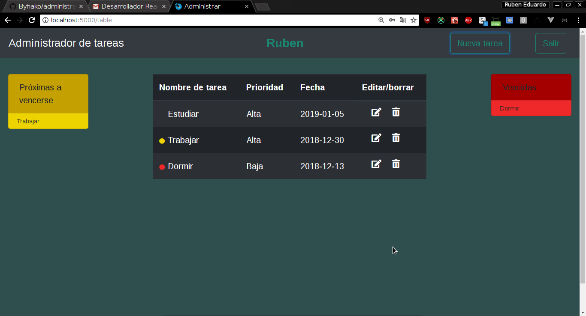

# Aplicación de administración de tareas.

Aplicación desarrollada en React, con stylus como preprocesador de css.
El servidor esta hecho en express y la base de datos con MongoDb version v4.0.5.

### use:

+ **Iniciamos mongoDb**

Nos ubicamos en la carpeta /server/services y corremos:

```
$ mongod --dbpath /home/ruben/Escritorio/administracion-tareas/server/services
```

+ **Iniciamos el servidor**
Dentro de la carpeta server corremos:
```
$ npm install
$ npm run dev
```

+ **Iniciamos UI**
Dentro de la carpeta client corremos:
```
$ npm install
$ npm start
```

---------------------------------
Al iniciar la aplicación tenemos la pantalla de bienvenida.

<p align="center">
  
</p>

Para comenzar debemos registar un nuevo usuario.

<p align="center">
  
</p>

Luego de registrarlo, ingresamos a la lista de tareas, que estará vacía para un usuario nuevo.  Cuando ya tenemos un usuario registrado podemos ingresar con el correo y contraseña registrados.

<p align="center">
  
</p>

La aplicación puede ser iniciada con el correo `ruben@mail.com` y contraseña `ruben`.

<p align="center">
  
</p>

Podemos crear nuevas tareas desde el boton de la navbar.

<p align="center">
  
</p>

Una vez creadas, las tareas están listadas en el centro. Las tareas cuya fecha de vencimiento es anterior a la fecha de hoy (fecha en la que se esta corriendo la aplicación) están clasificadas como tareas vencidas y se listan a la derecha, además al lado de la respectiva tarea aparece un círculo rojo.  Las tareas cuya fecha coincida con la de hoy o mañana son clasificadas como próximas a vencersen, serán listadas al lado izquierdo y aparece círculo amarillo al lado del nombre de la respectiva tarea.

<p align="center">
  
</p>

También podemos editar o borrar alguna tarea usando los íconos respectivos.

--------------------------------------

Los documentos de la base de datos están con la siguiente estructura.

```
{
	"name": "Ruben",
	"email": "ruben@mail.com",
	"password": "ruben"
	"tasks": [
		"nameTask": "Comer",
		"priority": "Alta",
		"date": "2018-12-30"
	]

}
```